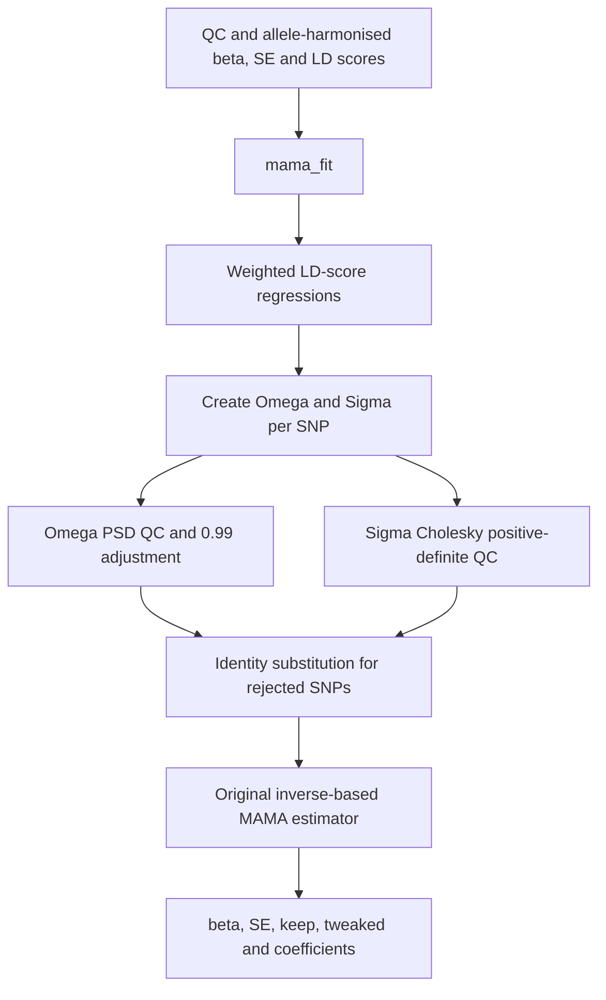

# mamars: R/Rust MAMA analysis

This installable R package provides a dependency-free Rust rewrite of the
numerical MAMA analysis. It preserves the estimator used by the reference code:

1. `a = Omega[p, ] / Omega[p, p]`
2. `C = Omega + Sigma - outer(a, Omega[p, ])`
3. `d = a' inverse(C) a`
4. `beta[p] = a' inverse(C) beta / d`, `se[p] = sqrt(1 / d)`

Rust retains the explicit inverse-based calculation rather than silently
changing the estimator. It processes one SNP at a time, reducing native working
memory from an `M x P x P x P` intermediate to `O(P^2)`.

## Function flow



| R function | Purpose |
|---|---|
| `mama_fit()` | Recommended: regress coefficients and run all later numerical stages. |
| `mama_analysis()` | Construct matrices, QC, and estimate using saved coefficients. |
| `mama_core()` | Low-level estimator when Omega and Sigma already exist. |

## Installation

The machine needs R, a C compiler, and a Rust toolchain containing Cargo.

```r
install.packages("r-mama", repos = NULL, type = "source")
library(mamars)
```

## Numerical tutorial

Inputs must have passed the same filtering and allele harmonisation as the
reference pipeline. Every object must use the same SNP and population order.

```r
# M = 2 SNPs, P = 2 populations.
betas <- matrix(c(0.10, 0.20, -0.05, 0.04), 2, 2)
ses <- matrix(c(0.03, 0.04, 0.05, 0.06), 2, 2)
ldscores <- array(c(1.2, 1.4, 0.2, 0.1,
                    0.2, 0.1, 1.1, 1.3), c(2, 2, 2))

fit <- mama_fit(betas, ses, ldscores)
fit$ld_coef
fit$const_coef
fit$se2_coef

# Rejected rows must not be included in the final summary-statistic table.
result <- data.frame(beta_pop1 = fit$beta[fit$keep, 1],
                     se_pop1 = fit$se[fit$keep, 1])
```

For a constrained regression, `NA_real_` means “estimate this coefficient” and
a number fixes it exactly. This example fixes cross-population LD coefficients
to zero while fitting the diagonal:

```r
p <- ncol(betas)
ld_constraint <- matrix(0, p, p)
diag(ld_constraint) <- NA_real_
fit <- mama_fit(betas, ses, ldscores, ld_fixed = ld_constraint)
```

Saved regression coefficients can be reused without refitting:

```r
replayed <- mama_analysis(betas, ses, ldscores,
                          fit$ld_coef, fit$const_coef, fit$se2_coef)
stopifnot(all.equal(fit$beta, replayed$beta, tolerance = 1e-10))
```

## Correspondence and validation

`mama_fit()` follows `run_ldscore_regressions`: diagonal regression weights are
`1 / LD` above one, one for positive LD up to one, and zero otherwise;
cross-population weights are `1 / abs(LD)`. Fixed effects are subtracted before
weighted least squares. A one-sided Jacobi SVD retains the minimum-norm behavior
of `numpy.linalg.lstsq` without forming the less stable `X'X` normal equations.

Matrix construction, positive-(semi)-definiteness checks, the original 0.99
Omega adjustment loop, rejected-SNP identity substitution, and the final
inverse-based estimator are all performed in Rust. File parsing, summary-stat
filtering, and allele harmonisation remain explicit preprocessing because those
steps depend on study-specific column mappings and allele policies.

For reproducibility, archive the harmonised inputs, population order, all three
coefficient matrices, package version, and `keep`/`tweaked` flags. Compare new
platform builds to fixed Python fixtures with a declared floating-point
tolerance before production use.
